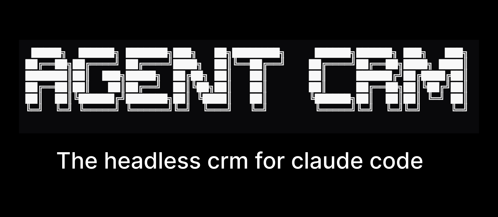

<div align="center">



</div>

Claude is running your GTM. Your lead lists live in CSVs because existing CRMs were built for humans, not agents. Their MCPs slow you down, bloat your context, and kill your usage limits.

Agent CRM gives Claude a structured backend it can query, edit, diff, validate, and merge.

The source of truth is a `.acrm` workspace. UIs, CLIs, scripts, and agents all operate on it.

```txt
                    ┌──────────────┐
                    │  Custom UIs  │
                    └──────┬───────┘
                           │
┌────────────┐      ┌──────▼──────┐      ┌───────────────┐
│ AI Agents  ├─────►│  .acrm      │◄─────┤ CLI / Scripts │
└────────────┘      └─────────────┘      └───────────────┘
```

## Quickstart

Install the CLI:

```bash
npm install -g @agent-crm/cli
```

Create your first workspace and query it:

```bash
acrm init                              # creates .acrm workspace
acrm execute "select * from people limit 5;"
```

Advanced/unsafe: if you understand the risks and want Claude to run commands without permission prompts, start it with `claude --dangerously-skip-permissions`.

## Why Agent CRM
- **🧩 Headless:** Ships as a CLI.
- **⚒️ Skills based:** Claude writes skills against the CLI (transcript ingestion, stale-deal sweeps, weekly reports) as `.md` files.
- **🧱 Modeled:** uses [Attio's data model](./SCHEMA.md) out of the box. Typed, related, queryable with plain SQL. Fixed schema = predictable agent edits.
- **🔀 Version controlled:** every change is a checkpoint on a branch. Diff, merge, revert, time-travel.


## How Claude runs your GTM

Skills are how Claude does the work. Bring your own, or use the ones we ship — `prep-call`, `post-call`, `follow-up`. Claude can write new ones in seconds.

**[`prep-call`](.claude/skills/prep-call.md).** Before a meeting, Claude pulls the person's full history from your `.acrm`, fetches their LinkedIn profile (cached, 14-day TTL), and hands you a one-pager with discovery questions tied to what they've actually been talking about.

**[`post-call`](.claude/skills/post-call.md).** After a meeting, Claude pulls the transcript from Granola, attaches it to the person, logs a call activity with the extracted problem + would-pay signal, updates the deal stage, and creates follow-up tasks — all on a branch you review before merging.

**[`follow-up`](.claude/skills/follow-up.md).** Claude queries `.acrm` for leads with stale activity, reads the prior thread for each, and drafts the next message in your tone of voice. You review and send.

Each skill is a markdown file in `.claude/skills/`. Here's what `post-call` looks like:

```markdown
---
description: Pull a Granola transcript, attach it to the person in .acrm, and log a call activity — all on a branch you review before merging
---

## Steps

1. **Resolve the person.**
   `acrm people find --query "$ARGUMENTS" --json`

2. **Find the Granola meeting** via `mcp__granola__list_meetings`.
   Filter to meetings where the person's name appears in the title or
   participants. If multiple, ask the user to pick.

3. **Fetch the transcript** with `mcp__granola__get_meeting_transcript`.

4. **Branch the workspace.**
   `acrm branch new sync/<YYYY-MM-DD>-<slug>`

5. **Attach the transcript and log the call.** Update the deal stage if
   it moved. Create tasks for committed next steps.

6. **Show the diff.** Do not merge — the user reviews and runs
   `acrm merge` themselves.
```

Need something custom? Just ask:

> _"Write me a skill that reads my call transcripts, updates deal stages, and posts a summary to Slack."_

Then to import your existing leads, just ask Claude:

> _"Import my leads from `./leads.csv`"_

The [`csv-import`](.claude/skills/csv-import.md) skill reads your headers, maps them to `.acrm`'s schema (people, companies, deals), dedupes on email + domain, and lands the import on a branch you review before merging.

## Roadmap
- [x] `.acrm` file format
- [ ] CLI
- [ ] Claude Code skills integration
- [ ] Realtime collaboration (multiplayer mode)
- [ ] Reference web UI (community)
